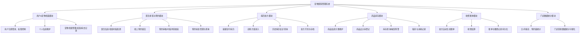

# microservices-practice-2412190607
课程：微服务实践
姓名：唐飞宇
学号：2412190607
用途：微服务课程作业仓库，存放每周作业文档与代码

# 宠物医院管理系统

## 项目目标和适用场景
### 项目目标
打造面向中小型社区宠物门诊的一体化数字化管理平台，解决传统诊所依靠纸质台账人工管理带来的预约冲突、病历丢失、库存不准、营收统计困难等痛点，实现预约、诊疗、处方、收费、库存、数据统计全流程线上化。项目采用**先单体、后微服务**的开发路线，用于完成本学期微服务架构课程实践。

### 适用场景
适用于单门店社区宠物诊所，支持宠物主人线上预约就诊，医生完成诊疗病历与处方开具，前台进行预约审核、排班管理、收费结算、药品库存管理与门诊经营数据统计。

## 主要用户角色、功能模块与系统能力
### 1. 宠物主人
注册登录，维护个人信息与多只宠物档案；浏览医生信息、值班时段，提交就诊预约；查看就医病历、复诊记录，查询缴费账单与历史消费记录。

### 2. 兽医医生
维护个人执业资料；查看当日预约列表；接诊时查阅宠物档案与历史病历辅助复诊；填写诊断信息，开具药品、检查项目处方。

### 3. 前台管理员
审核预约申请，自动校验医生时段，避免预约冲突；管理客户与宠物档案，配置医生可接诊时段；收费结算、药品出入库管理、库存余量监控；统计门诊订单量、接诊数量、营收总额等运营数据。

### 系统整体功能结构

## 各模块详细功能

### 1.用户 & 宠物档案模块
用户注册、登录、身份权限控制；个人信息维护；宠物档案新增、编辑、删除，记录宠物品种、年龄、疫苗记录、既往病史。
### 2.医生排班与预约模块
医生基础信息维护；医生值班时段配置；宠物主人线上预约提交；前台预约审核；预约时段冲突校验；预约记录查询与状态变更。
### 3.病历处方模块
新建就诊病历；录入病情诊断、治疗方案；历史病历查询，支持复诊查阅；处方开具，添加药品、化验检查项目；处方存档管理。
### 4.药品库存模块
药品基础信息分类维护；药品入库、出库登记；库存余量查询；库存不足预警；取药登记、药品消耗记录。
### 5.收费账单模块
依据处方自动生成就诊账单；就诊收费结算；账单持久化保存；历史缴费记录、账单详情查询。
### 6.门诊数据统计模块
统计每日 / 月度接诊订单、预约量、门诊总收入；基础经营数据可视化查询。

## 核心功能完整流程

## 当前项目范围和暂不实现的内容

### 当前项目实现范围：
多角色权限管理、宠物档案管理、医生排班、在线预约与预约冲突校验、病历处方管理、药品库存管控、收费账单结算、缴费记录查询、门诊经营数据统计。
### 暂不实现内容：
宠物住院护理模块、宠物商品线上商城、多分院连锁管理、远程视频问诊、第三方支付对接、短信消息推送。

## 后续可扩展方向：认证、服务拆分、消息、事务、监控和部署
认证授权：接入 JWT 实现统一身份认证，完善 RBAC 角色权限控制，隔离三类用户的访问权限。
服务拆分：单体应用拆分为独立微服务，拆分为用户档案服务、预约排班服务、病历处方服务、药品库存服务、收费统计服务，服务独立开发部署。
消息队列：引入消息队列，实现预约审核通知、库存不足告警等异步消息推送。
事务控制：实现分布式事务，保障缴费和药品库存扣减的数据一致性，防止库存超扣、账目不一致。
服务监控：接入服务监控组件，采集接口请求、异常、吞吐量指标，实现服务健康监控。
容器部署：使用 Docker 打包各个微服务，完成容器化部署。
